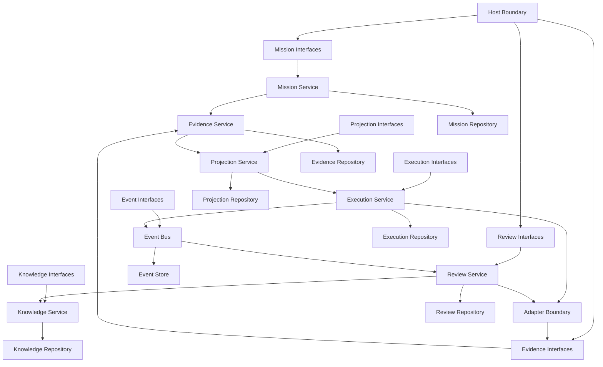
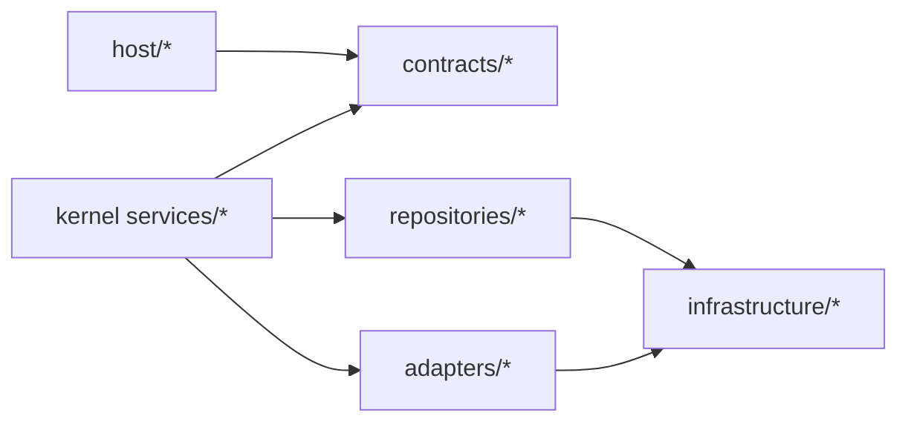

# Kernel Dependency Graph

## Purpose

Define the canonical dependency graph for the Nexus Kernel reference architecture.

This document is the blueprint for dependency injection boundaries and package/module layering.

## Scope

Covers dependencies between:

- services
- interfaces
- repositories
- events
- adapters
- hosts

This document defines architectural direction, not implementation frameworks.

## Primary Service Flow

```text
Mission
     |
     v
Evidence
     |
     v
Projection
     |
     v
Execution
     |
     v
Events
     |
     v
Review
     |
     v
Knowledge
```

## Expanded Dependency Topology



## Layered Package Boundaries



Dependency rules:

- Host layer depends only on contracts and orchestration entrypoints.
- Service layer depends on contracts, repositories, and adapter abstractions.
- Repository and adapter layers depend on infrastructure implementations.
- Infrastructure depends on no kernel domain service.
- No lower layer may depend on a higher layer.

## Service Dependency Matrix

| Consumer           | Depends on Services                                     | Depends on Interfaces                         | Depends on Repositories | Emits Events                                                              | Consumes Events                            |
| ------------------ | ------------------------------------------------------- | --------------------------------------------- | ----------------------- | ------------------------------------------------------------------------- | ------------------------------------------ |
| Mission Service    | Evidence Service                                        | Mission Contract, Evidence Contract           | Mission Repository      | MissionCreated, MissionPlanRevised                                        | ReviewCompleted, ActionableFindingProduced |
| Evidence Service   | none                                                    | Evidence Contract                             | Evidence Repository     | EvidenceAcquired, EvidenceAuthorized, EvidenceSuperseded                  | ReviewAccepted, AdapterResultAccepted      |
| Projection Service | Mission Service, Evidence Service                       | Projection Contract                           | Projection Repository   | ProjectionComputed, ProjectionInvalidated                                 | MissionPlanRevised, EvidenceSuperseded     |
| Execution Service  | Projection Service                                      | Execution Contract, Adapter Boundary Contract | Execution Repository    | TaskAssigned, ExecutionStarted, ExecutionCompleted, ExecutionFailed       | ProjectionInvalidated                      |
| Event Bus          | all producers                                           | Event Bus Contract                            | Event Store             | DomainEventPublished                                                      | DomainEventReplayRequested                 |
| Review Service     | Execution Service, Projection Service, Evidence Service | Review Contract                               | Review Repository       | ReviewStarted, ReviewCompleted, ReviewAccepted, ActionableFindingProduced | ExecutionCompleted, MissionPlanRevised     |
| Knowledge Service  | Review Service, Evidence Service                        | Knowledge Contract                            | Knowledge Repository    | KnowledgeCaptured, KnowledgeUpdated, KnowledgeSuperseded                  | ReviewAccepted                             |

## Dependency Injection Blueprint

Composition roots:

- Host composition root: wires host-facing contracts to kernel orchestration entrypoints.
- Kernel composition root: wires services to interfaces and repositories.
- Adapter composition root: wires adapter contracts to concrete provider adapters.

Injection constraints:

- Inject interfaces, never concrete repository/adapter implementations, into services.
- Inject repositories per service ownership boundary.
- Inject Event Bus contract into services that publish/subscribe domain events.
- Inject host and adapter boundaries only through explicit contracts.

## Repository Ownership Boundaries

- Mission Repository is owned by Mission Service.
- Evidence Repository is owned by Evidence Service.
- Projection Repository is owned by Projection Service.
- Execution Repository is owned by Execution Service.
- Event Store is owned by Event Bus.
- Review Repository is owned by Review Service.
- Knowledge Repository is owned by Knowledge Service.

No repository is shared for writes across service ownership boundaries.

## Host and Adapter Boundary Placement

- Host boundary injects mission requests, workspace observations, and approvals.
- Adapter boundary executes delegated execution/review work and returns attributable outcomes.
- Adapter outputs become authoritative only after acceptance through review/evidence workflow.

## Reference Implementation Mapping

```text
src/kernel/
  mission/
  evidence/
  projection/
  execution/
  review/
  knowledge/
  events/
```

```text
knowledge/reference/
  kernel-reference-architecture.md
  kernel-dependency-graph.md
  service-catalog/
  interface-contracts/
```

## Relationship to RFC Ownership

- RFC-0001 -> Mission Service and Mission Repository
- RFC-0002 -> Evidence Service and Evidence Repository
- RFC-0003 -> Projection Service and Projection Repository
- RFC-0004 -> Execution Service and Execution Repository
- RFC-0005 -> Event Bus and Event Store
- RFC-0006 -> Review Service and Review Repository
- RFC-0007 -> Knowledge Service and Knowledge Repository
- RFC-0008 -> Adapter Boundary Contract
- RFC-0009 -> Host Boundary Contract
- RFC-0010 -> Cross-service boundary enforcement
