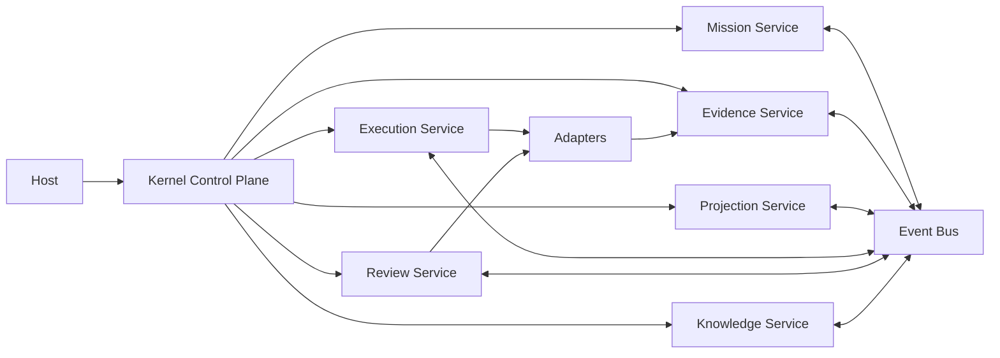

# Kernel Reference Architecture

## Intent

Define a service-oriented reference architecture for the Nexus Kernel that satisfies RFC-0001 through RFC-0010 without prescribing implementation details.

## Architectural Layers

```text
Developer
  -> Host Contract Boundary (RFC-0009)
  -> Kernel Control Plane (RFC-0010)
  -> Kernel Domain Services (RFC-0001..RFC-0008)
  -> Adapter Contract Boundary (RFC-0008)
  -> External Provider Systems
```

## Core Service Topology



## Dependency Blueprint

See [Kernel Dependency Graph](kernel-dependency-graph.md) for the expanded dependency model across services, interfaces, repositories, events, adapters, and hosts.

## Service Catalog

Detailed service definitions are split into the service catalog:

- [Kernel Control Plane](service-catalog/kernel-control-plane.md)
- [Mission Service](service-catalog/mission-service.md)
- [Evidence Service](service-catalog/evidence-service.md)
- [Projection Service](service-catalog/projection-service.md)
- [Execution Service](service-catalog/execution-service.md)
- [Review Service](service-catalog/review-service.md)
- [Knowledge Service](service-catalog/knowledge-service.md)
- [Event Bus](service-catalog/event-bus.md)

Companion interface contracts are defined in:

- [Interface Contracts Index](interface-contracts/README.md)
- [Host Ingress Contract](interface-contracts/host-ingress-contract.md)
- [Mission Service Contract](interface-contracts/mission-service-contract.md)
- [Evidence Service Contract](interface-contracts/evidence-service-contract.md)
- [Projection Service Contract](interface-contracts/projection-service-contract.md)
- [Execution Service Contract](interface-contracts/execution-service-contract.md)
- [Review Service Contract](interface-contracts/review-service-contract.md)
- [Knowledge Service Contract](interface-contracts/knowledge-service-contract.md)
- [Event Bus Contract](interface-contracts/event-bus-contract.md)
- [Adapter Boundary Contract](interface-contracts/adapter-boundary-contract.md)

## Service-to-RFC Ownership Matrix

| Service              | Primary RFC Ownership |
| -------------------- | --------------------- |
| Mission Service      | RFC-0001              |
| Evidence Service     | RFC-0002              |
| Projection Service   | RFC-0003              |
| Execution Service    | RFC-0004              |
| Event Bus            | RFC-0005              |
| Review Service       | RFC-0006              |
| Knowledge Service    | RFC-0007              |
| Kernel Control Plane | RFC-0010              |
| Host Boundary        | RFC-0009              |
| Adapter Boundary     | RFC-0008              |

## Cross-Cutting Architectural Constraints

- Determinism: equivalent mission plus evidence plus policies must produce equivalent orchestration outcomes.
- Explainability: every service decision must trace to evidence, policies, and domain events.
- Boundary Integrity: host and adapters do not own authoritative engineering truth.
- Evidence Authority: authoritative engineering truth is owned by Evidence Service only.
- Human Authority: acceptance and final authority remain governed by human-controlled policy.
